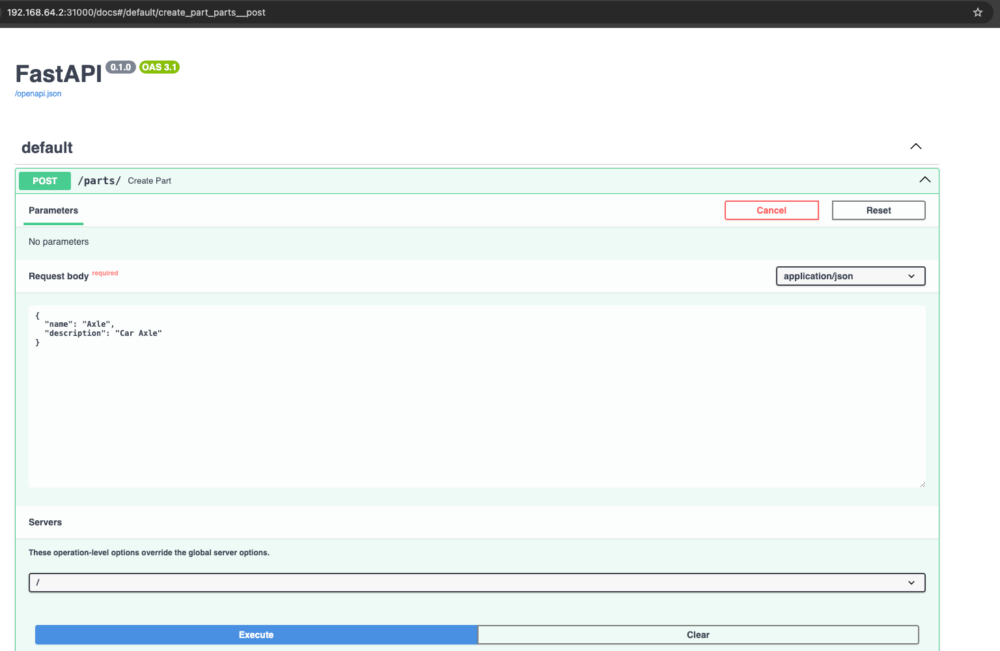
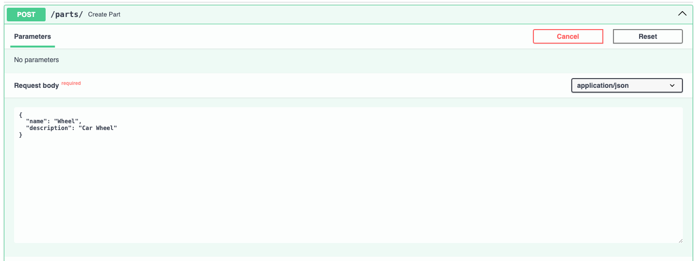
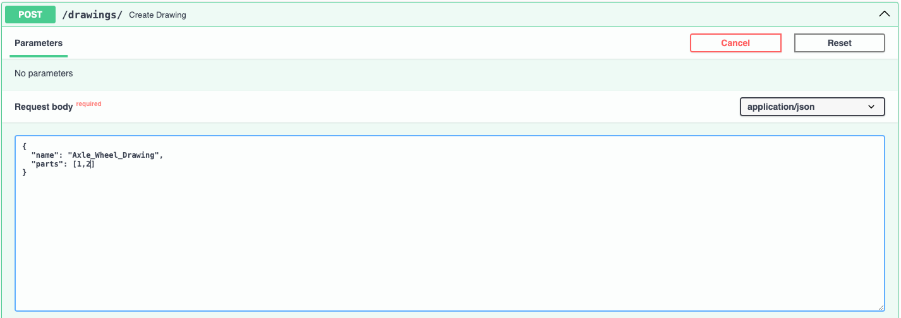
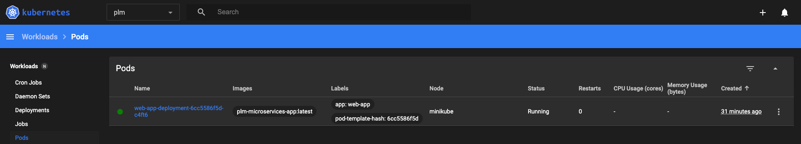
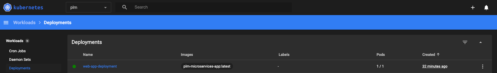
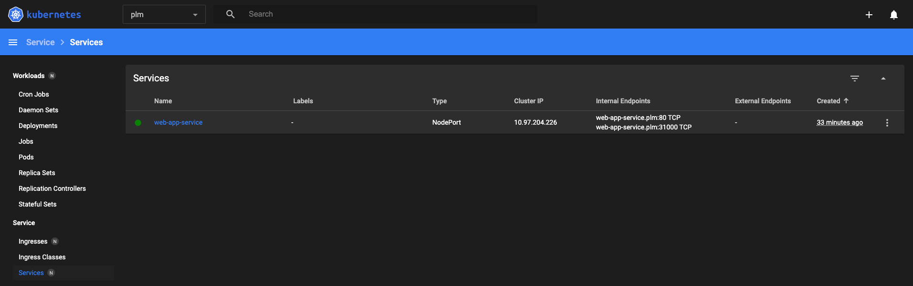

## PLM Microservices using Python Full stack
# PLM as enterprise platform has been largely implemented in Java Enterprise
This project attempts to create a standard enterprise microservices based architecture using popular 
frameworks as mentioned below 
```
FASTAPI
Pydantic
SQLAlchemy
```

# Setup 
OS - Mac 10.15 Sequoia, Docker Desktop , Minikube and PostgreSQL DB 14

# Database changes
## Add the following line to the pg_hba.conf
```
host    all             all             0.0.0.0/0               trust
```
## Create schema plm
```
CREATE SCHEMA plm;
```

## Add the following line to the postgresql.conf
```
listen_addresses = '*'
port = 5432
```
## Check database connection (postgres) from pod
```
nc -vz localhost 5432
```
# Kubernetes networking on Mac OS (IP address may change based on your network)
 Add the following line to the /etc/hosts (host.minikube.internal points to the ip address on your local mac)

 For Windows/WSL2 host.minikube.internal is the bridge ip address when ifconfig is executed from WSL2, refer the example below.
 
 This can be obtained from mac by running command ifconfig and then getting the ip for bridge100, this ip is the host.minikube.internal
 
 Replace the minikube_ip using the command minikube ip

 As a side note Docker desktop is not running on mac 
```
192.168.64.1    host.minikube.internal
minikube_ip     macbook.local

```

# WSL2 on Windows configuration settings
## Run the ifconfig command to get the ip address for the bridge network adpater 

Sample command output should be as below, please note the bridge IP 192.168.49.1(host.minikube.internal), this IP is hosting the applications, databases, any other running on WSL2

## WSL2 expooses eth0 address to connect it from Windows OS like a database postgres running in WSL2 and use the eth0 address and port 5432 to connect from Windows OS (PgAdmin4)
ifconfig

## WSL2 change the ip address in the configmap to the eth0 ip address 172.25.127.242 (host.minikube.internal, does not work on WSL2)

br-f8db590b89d5: flags=4099<UP,BROADCAST,MULTICAST>  mtu 1500  (host.minikube.internal ip address is 192.168.49.1)

        inet 192.168.49.1  netmask 255.255.255.0  broadcast 192.168.49.255
        ether 02:42:71:ba:26:6d  txqueuelen 0  (Ethernet)
        RX packets 0  bytes 0 (0.0 B)
        RX errors 0  dropped 0  overruns 0  frame 0
        TX packets 0  bytes 0 (0.0 B)
        TX errors 0  dropped 0 overruns 0  carrier 0  collisions 0

docker0: flags=4099<UP,BROADCAST,MULTICAST>  mtu 1500

        inet 172.17.0.1  netmask 255.255.0.0  broadcast 172.17.255.255
        ether 02:42:90:6b:ef:45  txqueuelen 0  (Ethernet)
        RX packets 0  bytes 0 (0.0 B)
        RX errors 0  dropped 0  overruns 0  frame 0
        TX packets 0  bytes 0 (0.0 B)
        TX errors 0  dropped 0 overruns 0  carrier 0  collisions 0

eth0: flags=4163<UP,BROADCAST,RUNNING,MULTICAST>  mtu 1500

        inet 172.25.127.242  netmask 255.255.240.0  broadcast 172.25.127.255
        inet6 fe80::215:5dff:fece:be86  prefixlen 64  scopeid 0x20<link>
        ether 00:15:5d:ce:be:86  txqueuelen 1000  (Ethernet)
        RX packets 6  bytes 837 (837.0 B)
        RX errors 0  dropped 0  overruns 0  frame 0
        TX packets 17  bytes 1248 (1.2 KB)
        TX errors 0  dropped 0 overruns 0  carrier 0  collisions 0

lo: flags=73<UP,LOOPBACK,RUNNING>  mtu 65536

        inet 127.0.0.1  netmask 255.0.0.0
        inet6 ::1  prefixlen 128  scopeid 0x10<host>
        loop  txqueuelen 1000  (Local Loopback)
        RX packets 25  bytes 7705 (7.7 KB)
        RX errors 0  dropped 0  overruns 0  frame 0
        TX packets 25  bytes 7705 (7.7 KB)
        TX errors 0  dropped 0 overruns 0  carrier 0  collisions 0

virbr0: flags=4099<UP,BROADCAST,MULTICAST>  mtu 1500

        inet 192.168.122.1  netmask 255.255.255.0  broadcast 192.168.122.255
        ether 52:54:00:2d:55:74  txqueuelen 1000  (Ethernet)
        RX packets 0  bytes 0 (0.0 B)
        RX errors 0  dropped 0  overruns 0  frame 0
        TX packets 0  bytes 0 (0.0 B)
        TX errors 0  dropped 0 overruns 0  carrier 0  collisions 0
```
ifconfig

```

# Start minikube on Mac
## Commands
```
minikube start --driver=hyperkit
minikube -p minikube docker-env                                                                                      ─╯
eval $(minikube docker-env)
minikube addons enable ingress
minikube ip
```

# Start minikube on Ubuntu
## Commands
```
minikube start --driver=docker
minikube -p minikube docker-env                                                                                      ─╯
eval $(minikube docker-env)
minikube addons enable ingress
minikube ip
```

# Start minikube on WSL2/Windows
```
minikube start --driver=docker
minikube -p minikube docker-env                                                                                      ─╯
eval $(minikube docker-env)
minikube addons enable ingress
minikube ip
```

# Create container image using docker
## Build the docker image without cache
```
docker build --no-cache -t plm-microservices-app:latest .
```
## Run the docker container on Ubuntu with the flag --net=host, so no need to use host.docker.internal on ubuntu only
``` 
docker run --net=host -p 8000:8000 plm-microservices-app:latest

```

# Deploy K8s file using the commands below
```
 kubectl apply -f namespace.yaml
 kubectl apply -f https://github.com/jetstack/cert-manager/releases/download/v1.6.1/cert-manager.yaml
 kubectl apply -f configmap.yaml -n plm
 kubectl apply -f secret.yaml -n plm
 kubectl apply -f deployment.yaml -n plm
 kubectl apply -f service.yaml -n plm
 kubectl apply -f clusterissuer.yaml -n plm
 kubectl apply -f certificate.yaml -n plm
 kubectl apply -f ingress.yaml -n plm
 kubectcl apply -f test-pod.yaml -n plm

```
# Test POD - Debugging (Optional)
```
kubectl exec -it test-pod -n plm -- sh
```
# Generate the service url using the command below

```
minikube service web-app-service -n plm
```
```
|-----------|-----------------|-------------|----------------------------|
| NAMESPACE |      NAME       | TARGET PORT |            URL             |
|-----------|-----------------|-------------|----------------------------|
| plm       | web-app-service |          80 | http://192.168.64.14:31000 |
|-----------|-----------------|-------------|----------------------------|
🎉  Opening service plm/web-app-service in default browser...
```

# Running the application - REST API using Swagger
```
Hit the url - http://192.168.64.14:31000/ ( if ingress is not configured , works on mac with hyperkit)
URL - https://macbook.local/docs ( if ingress is configured, USE THIS, works on mac with hyperkit)
```
# Use case 1: Create Parts

REST API - /parts/
## Create Axle (Part)


## Create Wheel (Part)



# Use case 2: Create Drawings

## Create Drawing (Connect the Axle and Wheel to the Drawing)



# Use case 3: Containerize the app using Docker
Pods running in the minikube


# Use case 4: Orchestrate the app using Kubernetes



# Use case 5: Deploy the app on Kubernetes

